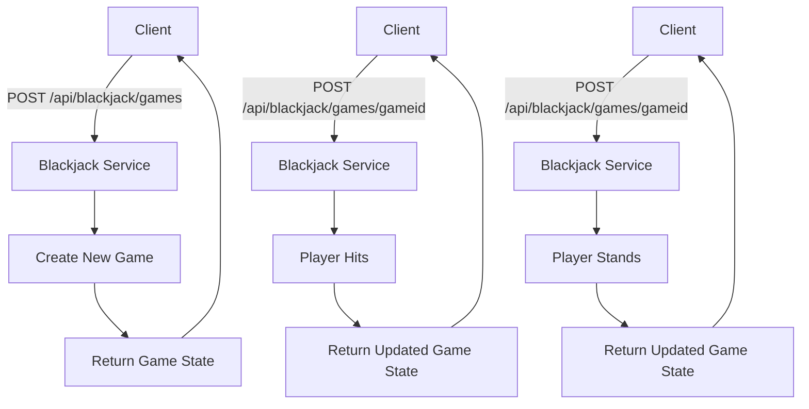

# Introduction to REST

REST, or Representational State Transfer, is an architectural style used to design networked applications. It uses a
stateless, client-server, cacheable communications protocol — typically HTTP.

Using RESTful principles allows different components, or even different systems, to communicate and interact with our
software's functionalities seamlessly.

## Core Concepts of REST

### 1. **Resources**

In REST, data and functionality are considered resources and can be accessed using a URL (Uniform Resource Locator).

For our Blackjack game, a resource could be a `GameState`, a `PlayerHand`, or a `Card`.

### 2. **HTTP Methods**

RESTful services use standard HTTP methods to perform operations on resources:

- **GET:** Retrieve a resource.
- **POST:** Create a resource.
- **PUT:** _(idempotent)_ Update an existing resource.
- **PATCH:** _(not guaranteed to be idempotent)_ Partially update an existing resource.
- **DELETE:** Remove a resource.

### 3. **Statelessness**

Each HTTP request from a client contains all the information the server needs to fulfill that request (like user
authentication data).

### 4. **Uniform Interface**

RESTful systems interact through a fixed set of operations (HTTP methods) and return resources in a consistent and
predictable manner.

## RESTful Blackjack API Example

### Visual Representation



### Starting a New Game

- **URL:** `/api/blackjack`
- **HTTP Method:** `POST`

```java
@PostMapping
public ResponseEntity<Game> startNewGame() {
   Game game = blackjackService.startNewGame();
   return new ResponseEntity<>(game, HttpStatus.CREATED);
}
```

#### Example request

```javascript
HTTP POST /api/blackjack
Payload:
{
    // empty at the moment as there are no initial values we need to provide
}
```

#### Example response

```javascript
HTTP STATUS 201 (Created)
Location: /api/blackjack/games/abc123
Content-Type: application/json

{
  "gameId": "abc123",
  "dealer": {
    "hand": [
      {"suit": "HIDDEN"},
      {"suit": "CLUBS", "value": 1}
    ],
    "status": "ACTIVE"
  },
  "player": {
    "playerId": "xyz789",
    "hand": [
      {"suit": "HEARTS", "value": 10},
      {"suit": "SPADES", "value": 9}
    ],
    "status": "ACTIVE"
  },
  "gameStatus": "ONGOING"
}
```

### Retrieving a Game

- **URL:** `/api/blackjack/{gameId}}`
- **HTTP Method:** `GET`

```java
@GetMapping("/{gameId}")
public ResponseEntity<Game> getGame() {
   Game game = blackjackService.getGame();
   return new ResponseEntity<>(game, HttpStatus.OK);
}
```

#### Example request

```javascript
HTTP GET /api/blackjack/abc123
```

#### Example response

```javascript
HTTP STATUS 200 (Created)
Content-Type: application/json

{
  "gameId": "abc123",
  "dealer": {
    "hand": [
      {"suit": "HIDDEN"},
      {"suit": "CLUBS", "value": 1}
    ],
    "status": "ACTIVE"
  },
  "player": {
    "playerId": "xyz789",
    "hand": [
      {"suit": "HEARTS", "value": 10},
      {"suit": "SPADES", "value": 9}
    ],
    "status": "ACTIVE"
  },
  "gameStatus": "ONGOING"
}
```

### Player Takes Action

- **URL:** `/api/blackjack/{gameId}/action`
- **HTTP Method:** `POST`

```java
@PostMapping("/{gameId}/action")
public ResponseEntity<Game> playerAction(@PathVariable String gameId, @RequestBody PlayerActionRequest request) {
   Game game = blackjackService.hit(gameId, request.getPlayerId());
   return new ResponseEntity<>(game, HttpStatus.OK);
}
```

#### Example request

```javascript
HTTP POST /api/blackjack/abc123/action
Payload:
{
    action: "HIT"
}
```

#### Example response

```javascript
HTTP STATUS 201 (Created)
Location: /api/blackjack/games/abc123
Content-Type: application/json
Payload:
{
  "gameId": "abc123",
  "dealer": {
    "hand": [
      {"suit": "HIDDEN"},
      {"suit": "CLUBS", "value": 1}
    ],
    "status": "ACTIVE"
  },
  "player": {
    "playerId": "xyz789",
    "hand": [
      {"suit": "HEARTS", "value": 10},
      {"suit": "SPADES", "value": 9},
      {"suit": "CLUBS", "value": 2}
    ],
    "status": "ACTIVE"
  },
  "gameStatus": "ONGOING"
}
```

### Example interface for Spring REST API

```java
@RestController
@RequestMapping("/api/v1/blackjack")
public interface BlackjackAPIv1 {
  @PostMapping("/games")
  @ResponseStatus(HttpStatus.CREATED)
  Game startNewGame();

  @PostMapping("/games/{gameId}")
  @ResponseStatus(HttpStatus.CREATED)
  Game playerAction(@PathVariable String gameId, @RequestBody Action action);

  @GetMapping("/games/{gameId}")
  @ResponseStatus(HttpStatus.OK)
  Game getGame(@PathVariable String gameId);
}
```

### Maven dependency

Update your spring boot dependency to

```xml
    <dependency>
      <groupId>org.springframework.boot</groupId>
      <artifactId>spring-boot-starter-web</artifactId>
    </dependency>
```